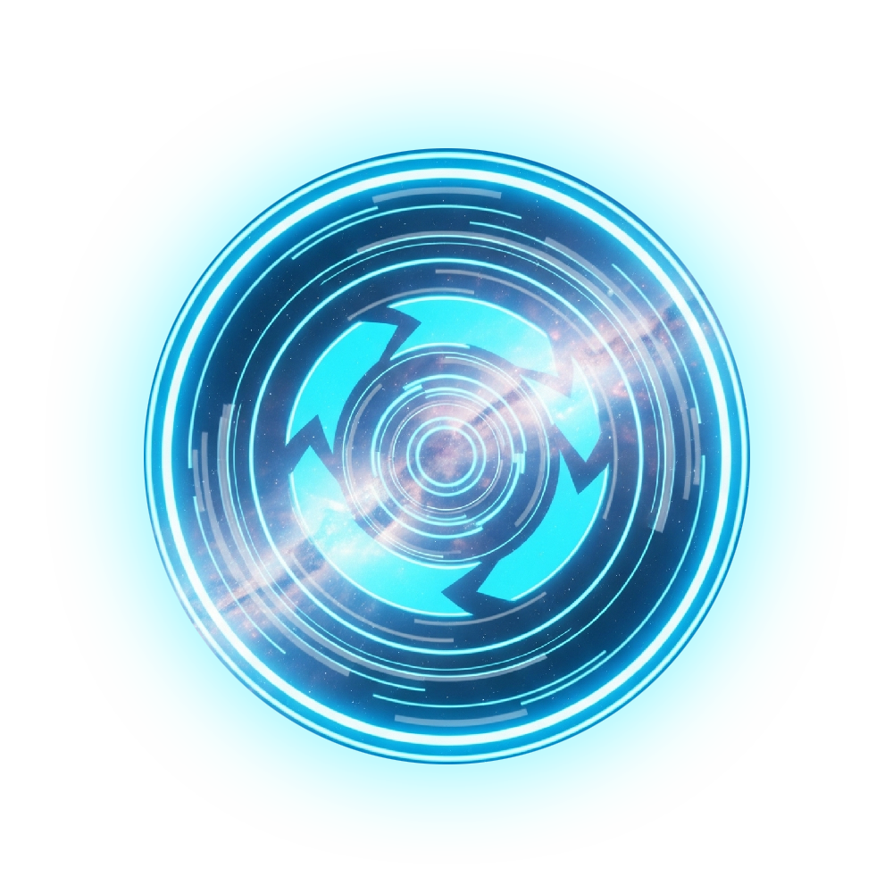

<p align="center">
  
</p>

<h1 align="center">Liquid Glass Spin Wheel Template</h1>

<p align="center">
  Template spin wheel modern berbasis HTML, CSS, dan JavaScript murni dengan tampilan Apple Liquid Glass yang clean, premium, dan responsif.
</p>

<p align="center">
  
  
  
  
</p>

## Tentang Project

Liquid Glass Spin Wheel Template adalah template website spin wheel yang bisa digunakan untuk giveaway, raffle, pemilihan menu, random picker, classroom games, event booth, atau kebutuhan undian sederhana.

Project ini dibuat tanpa framework dan tanpa build tools. Cukup buka `index.html`, lalu template langsung berjalan di browser modern.

## Fitur

- Spin wheel interaktif berbasis HTML Canvas.
- Tambah item baru melalui input.
- Hapus item satu per satu.
- Hapus semua item sekaligus.
- Popup hasil setelah spin selesai.
- Sound effect saat spin berjalan.
- Tampilan Apple Liquid Glass / visionOS inspired.
- Background gelap premium dengan blur blobs dan grain halus.
- Glass card untuk panel item, popup, tombol, dan footer.
- Desain responsive untuk desktop, tablet, dan mobile.
- Tidak membutuhkan library JavaScript eksternal.
- Mudah dikustomisasi dari satu file CSS dan satu file JavaScript.

## Preview

screenshot 


## Tech Stack

| Bagian | Teknologi |
| --- | --- |
| Markup | HTML5 |
| Styling | CSS3 |
| Logic | Vanilla JavaScript |
| Wheel Rendering | HTML Canvas |
| Font | Inter / system font fallback |
| Sound Effect | Mixkit public asset |

## Struktur Folder

```text
spin1/
|-- image/
|   `-- logo.png
|-- index.html
|-- styles.css
|-- script.js
```

## Cara Menjalankan

### 1. Clone Repository

```bash
git clone https://github.com/username/nama-repository.git
cd nama-repository
```

### 2. Buka di Browser

Karena project ini static, Anda bisa langsung membuka file:

```text
index.html
```

Atau gunakan local server jika ingin preview seperti environment hosting.

Contoh dengan VS Code Live Server:

```text
Right click index.html -> Open with Live Server
```

Contoh dengan Python:

```bash
python -m http.server 8000
```

Lalu buka:

```text
http://localhost:8000
```

## Cara Menggunakan Template

1. Buka website.
2. Masukkan item baru di input.
3. Klik tombol `+` untuk menambahkan item.
4. Klik tombol `SPIN`.
5. Hasil akan muncul dalam popup setelah animasi selesai.
6. Gunakan tombol hapus untuk menghapus item tertentu.
7. Gunakan `Hapus Semua` untuk mengosongkan daftar.

## Kustomisasi

### Mengubah Item Default

Buka `script.js`, lalu ubah array `items`:

```js
let items = ['Pizza', 'Burger', 'Sushi', 'Pasta', 'Steak', 'Tacos'];
```

Contoh:

```js
let items = ['Hadiah 1', 'Hadiah 2', 'Hadiah 3', 'Hadiah 4'];
```

### Mengubah Warna Segmen Wheel

Buka `script.js`, lalu ubah array `colors`:

```js
const colors = [
    '#ff6b6b', '#4ecdc4', '#45b7d1', '#f9ca24',
    '#f8b500', '#eb4d4b', '#6c5ce7', '#a29bfe',
    '#fd79a8', '#fdcb6e', '#55a3ff', '#00b894'
];
```

### Mengubah Durasi Spin

Durasi animasi spin ada di `script.js`:

```js
canvas.style.transition = 'transform 4s cubic-bezier(0.23, 1, 0.32, 1)';
```

Jika ingin spin lebih lama:

```js
canvas.style.transition = 'transform 6s cubic-bezier(0.23, 1, 0.32, 1)';
```

Jangan lupa sesuaikan `setTimeout`:

```js
}, 6000);
```

### Mengubah Sound Effect

Sound effect ada di `script.js`:

```js
const spinSound = new Audio('https://assets.mixkit.co/active_storage/sfx/1500/1500-preview.mp3');
```

Anda bisa menggantinya dengan URL audio lain yang legal untuk digunakan.

### Mengubah Volume Sound

Volume menggunakan angka `0` sampai `1`:

```js
spinSound.volume = 0.32;
```

Contoh lebih kecil:

```js
spinSound.volume = 0.18;
```

### Mengubah Tema Liquid Glass

Buka `styles.css`, lalu edit bagian `:root`:

```css
:root {
    --bg-0: #06070b;
    --bg-1: #10131d;
    --bg-2: #151826;
    --glass-bg: rgba(255, 255, 255, 0.08);
    --glass-border: rgba(255, 255, 255, 0.18);
}
```

### Mengubah Judul dan Subtitle

Buka `index.html`:

```html
<span class="title-text">SPIN</span>
<span class="title-accent">WHEEL</span>
<p class="subtitle">Putar Untuk Keberuntunganmu</p>
```

### Mengubah Footer

Buka bagian `<footer>` di `index.html`, lalu sesuaikan:

- Nama brand.
- Link sosial media.
- Email.
- Nomor kontak.
- Lokasi.
- Copyright.

## Deploy ke GitHub Pages

1. Push project ke GitHub.
2. Buka repository di GitHub.
3. Masuk ke `Settings`.
4. Pilih `Pages`.
5. Pada bagian `Build and deployment`, pilih:
   - Source: `Deploy from a branch`
   - Branch: `main`
   - Folder: `/root`
6. Klik `Save`.
7. Tunggu beberapa saat sampai URL GitHub Pages aktif.

Format URL biasanya:

```text
https://username.github.io/nama-repository/
```

## Deploy ke Netlify

1. Login ke Netlify.
2. Pilih `Add new site`.
3. Pilih `Deploy manually` atau import dari GitHub.
4. Upload folder project.
5. Tidak perlu build command.
6. Publish directory cukup root project.

## Deploy ke Vercel

1. Login ke Vercel.
2. Import repository dari GitHub.
3. Framework preset pilih `Other`.
4. Build command kosongkan.
5. Output directory kosongkan atau gunakan root.
6. Deploy.

## Browser Support

Template ini berjalan di browser modern:

- Google Chrome
- Microsoft Edge
- Safari
- Firefox

Efek `backdrop-filter` akan terlihat paling baik di browser yang mendukung CSS glass blur. Jika browser tidak mendukung, CSS sudah memiliki fallback warna glass yang tetap nyaman dilihat.

## Catatan Penting untuk Template

- Jangan menghapus `id` penting seperti `wheel`, `spinBtn`, `itemInput`, `addBtn`, `itemsList`, `clearBtn`, `resultPopup`, `popupResultText`, dan `closePopup` jika tidak ingin mengubah logic JavaScript.
- Wheel dirender melalui `<canvas>`, jadi perubahan warna dan teks segmen dilakukan dari `script.js`.
- Style utama berada di `styles.css`.
- Project tidak membutuhkan `npm install`.
- Project tidak memakai framework.

## Credits

- Sound effect: [Mixkit - Free Spin Sound Effects](https://mixkit.co/free-sound-effects/spin/)
- Sound used: `Fast bike wheel spin`
- Font: [Inter](https://fonts.google.com/specimen/Inter)
- UI inspiration: Apple Liquid Glass, iOS, visionOS, Apple Wallet, Apple Music, dan Apple Settings.

## License

Template ini bisa Anda gunakan, modifikasi, dan kembangkan untuk project pribadi maupun komersial.

Jika Anda mempublish ulang template ini, disarankan menambahkan file `LICENSE` resmi seperti MIT License agar hak penggunaan repository lebih jelas.

Catatan: sound effect dari Mixkit mengikuti ketentuan lisensi Mixkit. Silakan cek halaman lisensi Mixkit sebelum menggunakan asset untuk distribusi besar atau produk komersial.

## Author

Created by Reza Risky.

- GitHub: [zrdub](https://github.com/zrdub)
- LinkedIn: [rzrab](https://www.linkedin.com/in/rzrab/)

## Kontribusi

Kontribusi sangat terbuka. Anda bisa membuat issue atau pull request untuk:

- Menambahkan pilihan tema.
- Menambahkan mode dark/light.
- Menambahkan pengaturan durasi spin.
- Menambahkan fitur import/export item.
- Menambahkan screenshot dan demo page.

## Changelog

### v1.0.0

- Initial public template.
- Liquid Glass UI.
- Interactive spin wheel.
- Add/delete item.
- Result popup.
- Spin sound effect.
- Responsive layout.
